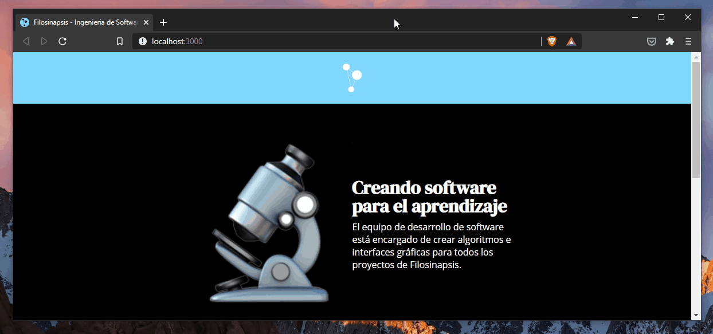

<h1 align="center">🧠⚙️ Filosinapsis -> Ingeniería de Software 📚💻</h1>
<p align="center">Information about the software development of Filosinapsis</p>

<!-- Shields -->
<p align="center">
  <!-- Node -->
  
  <!-- React -->
  
  <!-- Vercel -->
  
</p>



<!-- Stars -->
<p align="center">
⭐ Hope you liked this project. <b>Give it a star!</b> 🎉<br/>

</p>


## 🚀 Deployment
💻 Once you have cloned or directly downloaded this repository: Open a terminal, go to the project 
folder and run:

📦 Install the dependencies

```bash
npm install
```

💻 Start development mode
```bash
npm start
```

🎉 **Great! Start using or developing in the Filosinapsis Software Engineering project.**


## 🧪 Testing
The website is implemented with a small testing snippet to verify that it rederizes without any problem
```JavaScript
it('renders slogan without crash', () => {
  const { getByText } = render(<App/>);
  const sloganElement = getByText(/Creando software para el aprendizaje/i);
  expect(sloganElement).toBeInTheDocument();
});
```


## ✍ Developers
* **[Marcelo Arias](https://github.com/360macky)** - `@360macky`

## 📃 License
Distributed under the MIT License.
See [`LICENSE`](./LICENSE) for more information.
